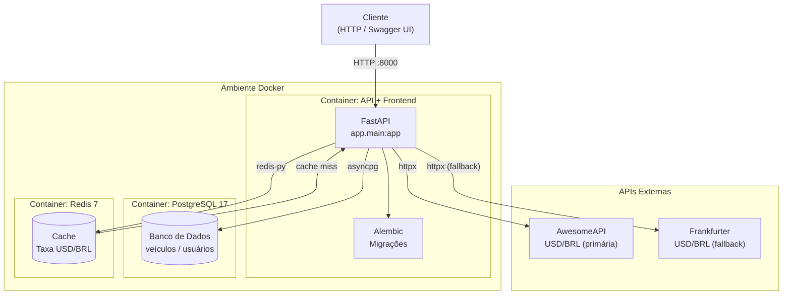

# Arquitetura do Sistema

```mermaid
graph TB
    Cliente["Cliente\n(HTTP / Swagger UI)"]

    subgraph Docker["Ambiente Docker"]
        subgraph AppContainer["Container: API + Frontend"]
            API["FastAPI\napp.main:app"]
            Alembic["Alembic\nMigrações"]
        end

        subgraph DBContainer["Container: PostgreSQL 17"]
            PG[("Banco de Dados\nveículos / usuários")]
        end

        subgraph CacheContainer["Container: Redis 7"]
            Redis[("Cache\nTaxa USD/BRL")]
        end
    end

    subgraph Externo["APIs Externas"]
        Awesome["AwesomeAPI\nUSD/BRL (primária)"]
        Frankfurter["Frankfurter\nUSD/BRL (fallback)"]
    end

    Cliente -->|"HTTP :8000"| API
    API --> Alembic
    API -->|"asyncpg"| PG
    API -->|"redis-py"| Redis
    Redis -->|"cache miss"| API
    API -->|"httpx"| Awesome
    API -->|"httpx (fallback)"| Frankfurter
```
