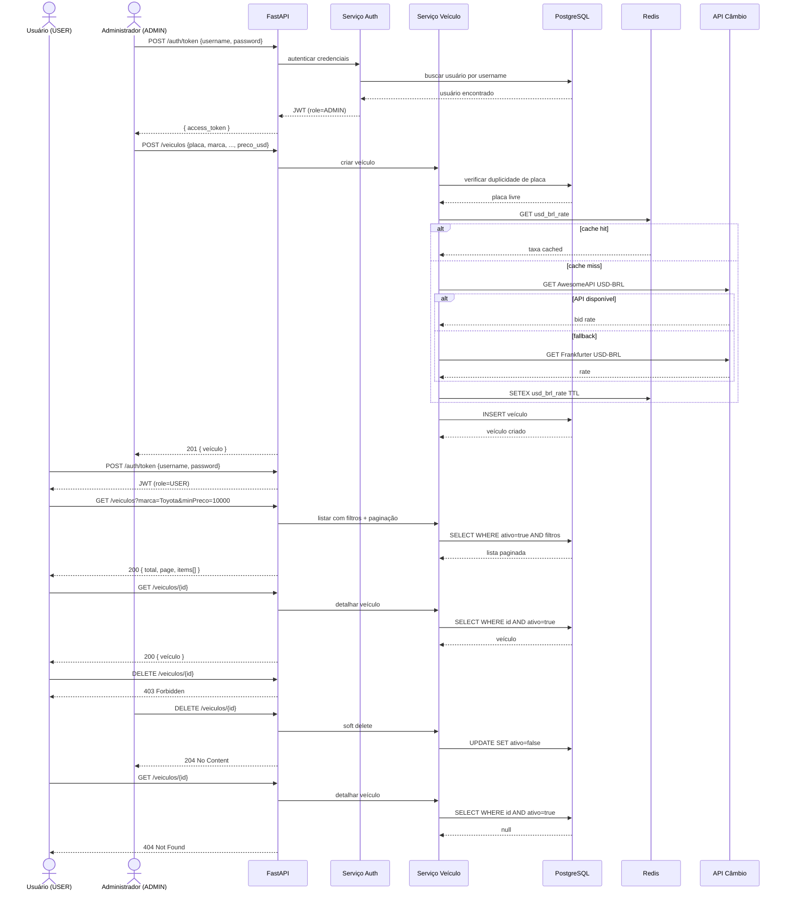

# Fluxo da API

## Autenticação e operações CRUD completas

```mermaid
sequenceDiagram
    actor U as Usuário (USER)
    actor A as Administrador (ADMIN)
    participant API as FastAPI
    participant Auth as Serviço Auth
    participant Svc as Serviço Veículo
    participant DB as PostgreSQL
    participant Cache as Redis
    participant FX as API Câmbio

    A->>API: POST /auth/token {username, password}
    API->>Auth: autenticar credenciais
    Auth->>DB: buscar usuário por username
    DB-->>Auth: usuário encontrado
    Auth-->>API: JWT (role=ADMIN)
    API-->>A: { access_token }

    A->>API: POST /veiculos {placa, marca, ..., preco_usd}
    API->>Svc: criar veículo
    Svc->>DB: verificar duplicidade de placa
    DB-->>Svc: placa livre
    Svc->>Cache: GET usd_brl_rate
    alt cache hit
        Cache-->>Svc: taxa cached
    else cache miss
        Svc->>FX: GET AwesomeAPI USD-BRL
        alt API disponível
            FX-->>Svc: bid rate
        else fallback
            Svc->>FX: GET Frankfurter USD-BRL
            FX-->>Svc: rate
        end
        Svc->>Cache: SETEX usd_brl_rate TTL
    end
    Svc->>DB: INSERT veículo
    DB-->>Svc: veículo criado
    API-->>A: 201 { veículo }

    U->>API: POST /auth/token {username, password}
    API-->>U: JWT (role=USER)

    U->>API: GET /veiculos?marca=Toyota&minPreco=10000
    API->>Svc: listar com filtros + paginação
    Svc->>DB: SELECT WHERE ativo=true AND filtros
    DB-->>Svc: lista paginada
    API-->>U: 200 { total, page, items[] }

    U->>API: GET /veiculos/{id}
    API->>Svc: detalhar veículo
    Svc->>DB: SELECT WHERE id AND ativo=true
    DB-->>Svc: veículo
    API-->>U: 200 { veículo }

    U->>API: DELETE /veiculos/{id}
    API-->>U: 403 Forbidden

    A->>API: DELETE /veiculos/{id}
    API->>Svc: soft delete
    Svc->>DB: UPDATE SET ativo=false
    API-->>A: 204 No Content

    U->>API: GET /veiculos/{id}
    API->>Svc: detalhar veículo
    Svc->>DB: SELECT WHERE id AND ativo=true
    DB-->>Svc: null
    API-->>U: 404 Not Found
```
