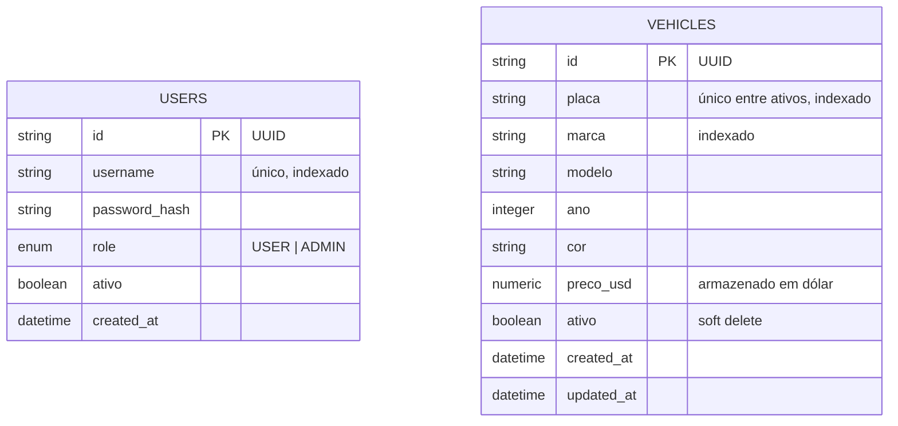

# Modelo de Dados

## Observações

- `ativo = false` representa registros removidos via soft delete — nunca excluídos fisicamente.
- `preco_usd` é armazenado em dólar americano (USD). A conversão para BRL é feita em tempo de consulta usando a taxa em cache no Redis.
- `placa` possui índice único parcial no banco (`WHERE ativo = true`), ou seja, a mesma placa pode ser reutilizada após um soft delete. A validação na camada de serviço também filtra apenas veículos ativos, retornando HTTP 409 antes de atingir o banco.
